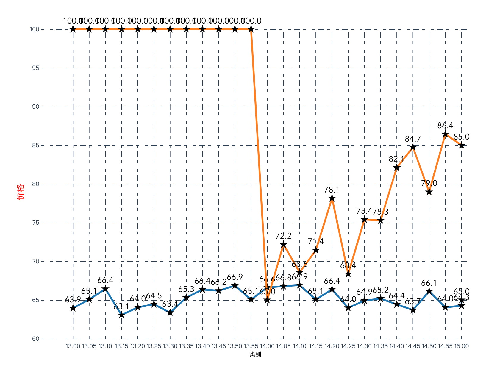

# data-vis

用D3js打造自己的可视化工具集，是用来学习D3的一种途径和方式。目前使用D3完成了直方图、折线图、饼图和散点图的封装，封装后工具使用API参考了AntV和ECharts的风格。

## 直方图


Vue2 使用示例

```html
<template>
  <div id="column-div"></div>
</template>

<script>
import Column from '../../general/column';

const data1 = [
  {
    name: 'London',
    月份: 'Jan.',
    月均降雨量: 18.9,
  },
  {
    name: 'London',
    月份: 'Feb.',
    月均降雨量: 28.8,
  },
  {
    name: 'London',
    月份: 'Mar.',
    月均降雨量: 39.3,
  },
  {
    name: 'London',
    月份: 'Apr.',
    月均降雨量: 81.4,
  },
  {
    name: 'London',
    月份: 'May',
    月均降雨量: 47,
  },
  {
    name: 'London',
    月份: 'Jun.',
    月均降雨量: 20.3,
  },
  {
    name: 'London',
    月份: 'Jul.',
    月均降雨量: 24,
  },
  {
    name: 'London',
    月份: 'Aug.',
    月均降雨量: 35.6,
  },
  {
    name: 'Berlin',
    月份: 'Jan.',
    月均降雨量: 15,
  },
  {
    name: 'Berlin',
    月份: 'Feb.',
    月均降雨量: 23.2,
  },
  {
    name: 'Berlin',
    月份: 'Mar.',
    月均降雨量: 34.5,
  },
  {
    name: 'Berlin',
    月份: 'Apr.',
    月均降雨量: 99.7,
  },
  {
    name: 'Berlin',
    月份: 'May',
    月均降雨量: 52.6,
  },
  {
    name: 'Berlin',
    月份: 'Jun.',
    月均降雨量: 35.5,
  },
  {
    name: 'Berlin',
    月份: 'Jul.',
    月均降雨量: 37.4,
  },
  {
    name: 'Berlin',
    月份: 'Aug.',
    月均降雨量: 42.4,
  },
  {
    name: 'Beijing',
    月份: 'Jan.',
    月均降雨量: -18.9,
  },
  {
    name: 'Beijing',
    月份: 'Feb.',
    月均降雨量: 28.8,
  },
  {
    name: 'Beijing',
    月份: 'Apr.',
    月均降雨量: 47,
  },
];

export default {
  mounted() {
    const column = new Column({
      data: data1,
      xField: '月份',
      yField: '月均降雨量',
      seriesField: 'name',
      label: {
        position: 'middle',
        style: {
          fontSize: 10,
          fill: 'black',
        },
        formatter: (datum) => {
          console.log(datum);
          return `${datum.月均降雨量}`;
        },
      },
      container: '#column-div',
      width: 800,
      height: 600,
    });
    column.render();
  },
};
</script>
```

## 饼图


Vue2 使用示例

```html
<template>
  <div id="pie-div"></div>
</template>

<script>
import Pie from '../../general/pie';

const data = [
  {
    type: '家具家电',
    sales: 38
  },
  {
    type: '粮油副食',
    sales: 52
  },
  {
    type: '生鲜水果',
    sales: 61
  },
  {
    type: '美容洗护',
    sales: 145
  },
  {
    type: '母婴用品',
    sales: 48
  }
];

export default {
  mounted() {
    const pie = new Pie({
      container: '#pie-div',
      data,
      appendPadding: 0.001,
      label: {
        position: 'outer',
        style: {
          fill: '#000',
          fontSize: 16
        },
        formatter: (datum, index) => `${data[index].sales} ¥`
      },
      statistic: {
        title: {
          style: {
            fill: '#000',
            fontSize: 18
          },
          formatter: () => '统计'
        },
        content: {
          style: {
            fill: '#000',
            fontSize: 20
          },
          formatter: () => {
            return `${data.reduce((prev, cur) => cur.sales + prev, 0)} ¥`;
          }
        }
      },
      angleField: 'sales',
      colorField: 'type',
      radius: 0.9,
      innerRadius: 0.4,
      width: 800,
      height: 600
    });
    pie.render();
  }
};
</script>
```

## 折线图



Vue2 使用示例

```html
<template>
  <div id="line-div"></div>
</template>

<script>
import Line from '../../general/line';

const data1 = [
  { date: 'yesterday', time: '13.00', cpu: 63.93689627294421 },
  { date: 'yesterday', time: '13.05', cpu: 65.06585239044342 },
  { date: 'yesterday', time: '13.10', cpu: 66.42719381417056 },
  { date: 'yesterday', time: '13.15', cpu: 63.060669399125935 },
  { date: 'yesterday', time: '13.20', cpu: 64.04639809297761 },
  { date: 'yesterday', time: '13.25', cpu: 64.45117682728456 },
  { date: 'yesterday', time: '13.30', cpu: 63.35488066344804 },
  { date: 'yesterday', time: '13.35', cpu: 65.2969449309885 },
  { date: 'yesterday', time: '13.40', cpu: 66.35014444552017 },
  { date: 'yesterday', time: '13.45', cpu: 66.198378961063 },
  { date: 'yesterday', time: '13.50', cpu: 66.85520134738813 },
  { date: 'yesterday', time: '13.55', cpu: 65.05419984325125 },
  { date: 'yesterday', time: '14.00', cpu: 66.62243229531435 },
  { date: 'yesterday', time: '14.05', cpu: 66.77808066603122 },
  { date: 'yesterday', time: '14.10', cpu: 66.9144977524293 },
  { date: 'yesterday', time: '14.15', cpu: 65.05499508303669 },
  { date: 'yesterday', time: '14.20', cpu: 66.36871158902638 },
  { date: 'yesterday', time: '14.25', cpu: 63.973903073723044 },
  { date: 'yesterday', time: '14.30', cpu: 64.92585536363889 },
  { date: 'yesterday', time: '14.35', cpu: 65.17145801764055 },
  { date: 'yesterday', time: '14.40', cpu: 64.42516834555609 },
  { date: 'yesterday', time: '14.45', cpu: 63.701363912573775 },
  { date: 'yesterday', time: '14.50', cpu: 66.11568649665543 },
  { date: 'yesterday', time: '14.55', cpu: 64.0474592964878 },
  { date: 'yesterday', time: '15.00', cpu: 64.25676632707459 },
  { date: 'yesterday', time: '15.00', cpu: 65 },
  { time: '13.00', cpu: 100, date: 'today' },
  { time: '13.05', cpu: 100, date: 'today' },
  { time: '13.10', cpu: 100, date: 'today' },
  { time: '13.15', cpu: 100, date: 'today' },
  { time: '13.20', cpu: 100, date: 'today' },
  { time: '13.25', cpu: 100, date: 'today' },
  { time: '13.30', cpu: 100, date: 'today' },
  { time: '13.35', cpu: 100, date: 'today' },
  { time: '13.40', cpu: 100, date: 'today' },
  { time: '13.45', cpu: 100, date: 'today' },
  { time: '13.50', cpu: 100, date: 'today' },
  { time: '13.55', cpu: 100, date: 'today' },
  { time: '14.00', cpu: 65, date: 'today' },
  { time: '14.05', cpu: 72.16886580736812, date: 'today' },
  { time: '14.10', cpu: 68.57230489482068, date: 'today' },
  { time: '14.15', cpu: 71.43150028596347, date: 'today' },
  { time: '14.20', cpu: 78.14636866352923, date: 'today' },
  { time: '14.25', cpu: 68.36883432160218, date: 'today' },
  { time: '14.30', cpu: 75.39521675212667, date: 'today' },
  { time: '14.35', cpu: 75.27433214647408, date: 'today' },
  { time: '14.40', cpu: 82.10189835378893, date: 'today' },
  { time: '14.45', cpu: 84.7261454369566, date: 'today' },
  { time: '14.50', cpu: 78.96269733695286, date: 'today' },
  { time: '14.55', cpu: 86.43607929073264, date: 'today' },
  { time: '15.00', cpu: 85, date: 'today' }
];

export default {
  mounted() {
    const line = new Line({
      container: '#line-div',
      data: data1,
      xField: 'time',
      yField: 'cpu',
      seriesField: 'date',
      lineType: 'linear',
      point: {
        shape: 'star',
        size: 60
      },
      width: 800,
      height: 600,
      label: {
        position: 'top',
        formatter: datum => `${datum.cpu.toFixed(1)}`
      },
      xAxis: {
        lineStyle: {
          strokeDasharray: '5,10,5'
        },
        title: {
          text: '类别'
        }
      },
      yAxis: {
        lineStyle: {
          strokeDasharray: '5,10,5'
        },
        title: {
          text: '价格',
          autoRotate: true,
          style: {
            fill: 'red',
            fontSize: 14
          }
        },
        position: 'left'
      }
    });
    line.render();
  }
};
</script>
```

## 散点图


Vue2 使用示例

```html
<template>
  <div id="scatter-div"></div>
</template>

<script>
import Scatter from '../../general/scatter';

const data1 = [
  {
    'H/A': 'A',
    Team: 'Torino',
    'xG conceded': 0.62,
    'Shot conceded': 10,
    Result: '3'
  },
  {
    'H/A': 'H',
    Team: 'Atalanta',
    'xG conceded': 2.35,
    'Shot conceded': 23,
    Result: '1'
  },
  {
    'H/A': 'A',
    Team: 'Milan',
    'xG conceded': 1.89,
    'Shot conceded': 26,
    Result: '0'
  },
  {
    'H/A': 'H',
    Team: 'Chievo',
    'xG conceded': 1.4,
    'Shot conceded': 13,
    Result: '1'
  },
  {
    'H/A': 'A',
    Team: 'Bologna',
    'xG conceded': 1.02,
    'Shot conceded': 11,
    Result: 0
  },
  {
    'H/A': 'H',
    Team: 'Frosinone',
    'xG conceded': 0.56,
    'Shot conceded': 11,
    Result: '3'
  },
  {
    'H/A': 'H',
    Team: 'Lazio',
    'xG conceded': 1.01,
    'Shot conceded': 16,
    Result: '3'
  },
  {
    'H/A': 'A',
    Team: 'Empoli',
    'xG conceded': 1.56,
    'Shot conceded': 20,
    Result: '3'
  },
  {
    'H/A': 'H',
    Team: 'Spal',
    'xG conceded': 1.8,
    'Shot conceded': 6,
    Result: '0'
  },
  {
    'H/A': 'A',
    Team: 'Napoli',
    'xG conceded': 2.49,
    'Shot conceded': 26,
    Result: '1'
  },
  {
    'H/A': 'A',
    Team: 'Fiorentina',
    'xG conceded': 1.3,
    'Shot conceded': 14,
    Result: '1'
  },
  {
    'H/A': 'H',
    Team: 'Sampdoria',
    'xG conceded': 1.2,
    'Shot conceded': 8,
    Result: '3'
  },
  {
    'H/A': 'A',
    Team: 'Udinese',
    'xG conceded': 1.22,
    'Shot conceded': 9,
    Result: '0'
  },
  {
    'H/A': 'H',
    Team: 'Inter',
    'xG conceded': 2.68,
    'Shot conceded': 17,
    Result: '1'
  },
  {
    'H/A': 'A',
    Team: 'Cagliari',
    'xG conceded': 2.1,
    'Shot conceded': 16,
    Result: '1'
  },
  {
    'H/A': 'H',
    Team: 'Genoa',
    'xG conceded': 1.84,
    'Shot conceded': 15,
    Result: '3'
  },
  {
    'H/A': 'A',
    Team: 'Juventus',
    'xG conceded': 2.12,
    'Shot conceded': 20,
    Result: '0'
  },
  {
    'H/A': 'H',
    Team: 'Sassuolo',
    'xG conceded': 0.72,
    'Shot conceded': 10,
    Result: '3'
  },
  {
    'H/A': 'A',
    Team: 'Parma',
    'xG conceded': 0.58,
    'Shot conceded': 6,
    Result: '3'
  },
  {
    'H/A': 'H',
    Team: 'Torino',
    'xG conceded': 1.87,
    'Shot conceded': 10,
    Result: '3'
  },
  {
    'H/A': 'A',
    Team: 'Atalanta',
    'xG conceded': 2.68,
    'Shot conceded': 23,
    Result: '1'
  },
  {
    'H/A': 'H',
    Team: 'Milan',
    'xG conceded': 0.85,
    'Shot conceded': 8,
    Result: '1'
  },
  {
    'H/A': 'A',
    Team: 'Chievo',
    'xG conceded': 0.84,
    'Shot conceded': 16,
    Result: '3'
  },
  {
    'H/A': 'H',
    Team: 'Bologna',
    'xG conceded': 2.69,
    'Shot conceded': 20,
    Result: '3'
  },
  {
    'H/A': 'A',
    Team: 'Frosinone',
    'xG conceded': 1.51,
    'Shot conceded': 11,
    Result: '3'
  },
  {
    'H/A': 'A',
    Team: 'Lazio',
    'xG conceded': 1.77,
    'Shot conceded': 13,
    Result: '0'
  },
  {
    'H/A': 'H',
    Team: 'Empoli',
    'xG conceded': 0.14,
    'Shot conceded': 5,
    Result: '3'
  },
  {
    'H/A': 'A',
    Team: 'Real Madrid',
    'xG conceded': 3.58,
    'Shot conceded': 30,
    Result: '0'
  },
  {
    'H/A': 'H',
    Team: 'Viktoria Plzen',
    'xG conceded': 0.33,
    'Shot conceded': 7,
    Result: 3
  },
  {
    'H/A': 'H',
    Team: 'CSKA Moscow',
    'xG conceded': 0.73,
    'Shot conceded': 13,
    Result: '3'
  },
  {
    'H/A': 'A',
    Team: 'CSKA Moscow',
    'xG conceded': 1.1,
    'Shot conceded': 14,
    Result: '3'
  },
  {
    'H/A': 'H',
    Team: 'Real Madrid',
    'xG conceded': 1.87,
    'Shot conceded': 12,
    Result: '0'
  },
  {
    'H/A': 'A',
    Team: 'Viktoria Plzen',
    'xG conceded': 1.85,
    'Shot conceded': 13,
    Result: '0'
  },
  {
    'H/A': 'A',
    Team: 'Porto',
    'xG conceded': 3.71,
    'Shot conceded': 31,
    Result: '0'
  },
  {
    'H/A': 'H',
    Team: 'Porto',
    'xG conceded': 0.56,
    'Shot conceded': 7,
    Result: '3'
  }
];

export default {
  mounted() {
    const scatter = new Scatter({
      container: '#scatter-div',
      data: data1,
      xField: 'Shot conceded',
      yField: 'xG conceded',
      colorField: 'Result',
      point: {
        shape: 'star',
        style: {
          fill: 'green'
        }
      },
      label: {},
      width: 800,
      height: 600
    });
    scatter.render();
  }
};
</script>
```

## 本地运行

### 依赖安装

```
npm install
```

### Dev运行
```
npm run serve
```
